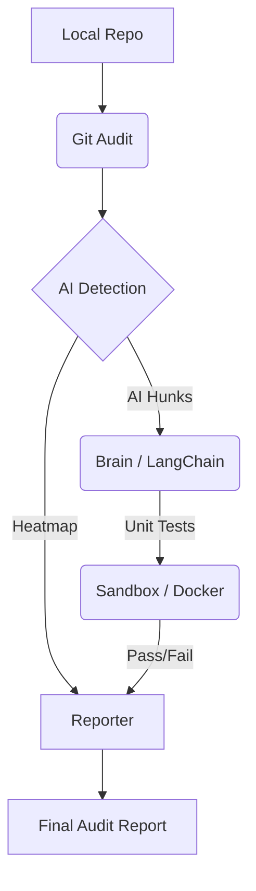

# Ghost-Writer

[](https://www.python.org/downloads/)
[](https://opensource.org/licenses/MIT)
[](https://ollama.ai/)
[](https://www.docker.com/)

**Ghost-Writer** is a cutting-edge security and provenance auditing tool designed for the AI-assisted coding era. It tracks the lineage of your codebase, identifies AI-generated hunks, assesses them for logical vulnerabilities, and verifies them in a sandboxed environment.

---

## Features

- **Phase 1: Git Provenance Tracking**: 
  - Analyzes commit velocity and metadata to distinguish between human and AI intent.
  - Generates an interactive "Heatmap" of your repository's AI density.
- **Phase 2: Risk Assessment (The Brain)**:
  - Leverages local LLMs (via Ollama) to peer-review AI-generated code.
  - Automatically identifies edge cases (null pointers, race conditions, overflows).
- **Phase 3: Automated Hardening (The Sandbox)**:
  - Generates Pytest/Jest cases for identified risks.
  - Executes tests in isolated Docker containers to verify code integrity.
- **Phase 4: Premium Reporting**:
  - Beautiful terminal dashboard powered by `rich`.
  - Exportable Markdown and HTML audit reports.

---

## Tech Stack

- **Logic**: Python 3.9+ (Click, Typer)
- **Aesthetics**: `rich` (Warp-like terminal UI)
- **Git Integration**: GitPython
- **LLM Orchestration**: LangChain + Ollama (Llama 3)
- **Containerization**: Docker SDK for Python

---

## Installation

### Prerequisites

1.  **Ollama**: Install from [ollama.ai](https://ollama.ai) and pull Llama 3:
    ```bash
    ollama pull llama3
    ```
2.  **Docker**: Ensure Docker Desktop is running.
3.  **Git**: Local git repository to audit.

### Setup

```bash
git clone https://github.com/Youssef-yoyoooo/ghost-writer.git
cd ghost-writer
pip install -e .
```

---

## Usage

Ghost-Writer features a **Warp-inspired interactive dashboard**. No need to memorize complex commands.

### 🎮 The Dashboard
Simply run the helper script to enter the interactive menu:
```powershell
.\ghost.ps1
```

### Step-by-Step Pipeline:

1.  **🔍 Git Audit**: Select this to scan your history. Look for files marked as **CRITICAL**.
2.  **🧠 Stress-Test**: Pick a risky file. **Llama 3** will find logic flaws and generate Pytest cases.
3.  **🛡️ Sandbox**: Execute those tests in an isolated **Docker container** to verify if the code breaks under pressure.
4.  **🚀 Full Scan**: Orchestrate the entire pipeline in one go.
```bash
ghost-writer full-scan --output report.md
```

---

## Architecture



---

## Contributing

Contributions are welcome! Please read the [Contributing Guide](CONTRIBUTING.md) for details on our code of conduct and the process for submitting pull requests.

## License

This project is licensed under the MIT License - see the [LICENSE](LICENSE) file for details.
